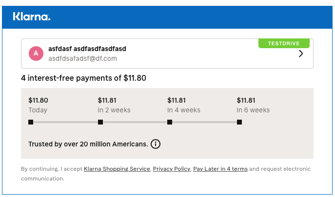
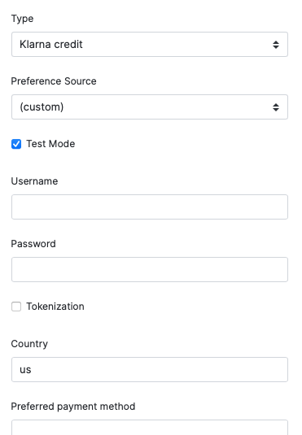

# Klarna Payments Integration for Solidus


This integration enables [Solidus](https://solidus.io) to provide [Klarna](https://www.klarna.com/) Payments as a payment option.



### Features

- Integrates seamlessly as a payment provider
- Supports auto capture
- Supports partial captures, refunds, and partial refunds
- Configurable design
- [ActiveMerchant](http://activemerchant.org) interface for Klarna Payments

### Limitations

- *Multiple* captures for one authorization are currently *not* supported because of Solidus' process when capturing payments. This might change in future versions of Solidus and this gem respectively. However, it is possible to use the MyKlarna portal to do that.
- Changing customer data after they completed the order is not synced to the Klarna API. So please be aware that you have to change the information in the MyKlarna portal if needed.
- A customer is able to choose multiple payment options for an order.  If an order does have multiple payment options, you should capture the most recent payment choice first, which be listed at the bottom of the list of payments.

### Supported Solidus Versions

- Solidus 1.3.x
- Solidus 1.4.x

Work is planned for compatibility with the 2.x branch of Solidus.

## Installation

Add this line to your application's Gemfile:

```ruby
gem 'klarna_gateway'
```

And then execute:

    $ bundle

Or install it yourself as:

    $ gem install klarna_gateway

In your project install Klarna specific migrations:

    $ rails generate klarna_gateway:install

## Solidus configuration

After the installation, create a new payment method and select `Spree::Gateway::KlarnaCredit` as the gateway. After saving the payment method, you can configure your Klarna credentials and set design options for how Klarna is displayed to the customer in the checkout.



The "country" option is mandatory and refers to the region the account is associated with. In the example above it's `us` for the USA, other values would be `uk` for the United Kingdom and `de` for Germany.

There are two other things to configure. Set the payment method to "active" and only enable it in the frontend. Some payment methods can be used in the backend by the merchant. As this is not appropriate for Klarna Payments, it should be disabled. You can also configure to automatically capture the payments when the customer confirms their order.


*Note*: After you ran `klarna_gateway:install` the initializer in `config/initializers/klarna_gateway.rb` allows some configuration. It's usually not necessary to touch the file unless you're sure what you're doing.


## Technical information

### API documentation

- [Klarna's API](https://developers.klarna.com/api/) is used by the payment gateway
- [Javascript SDK](https://credit.klarnacdn.net/lib/v1/index.html) for the frontend part

For more information see [Klarna's Developers Portal](https://developers.klarna.com/).

## Contributing

Contributions are always welcome. If you find a bug or have a suggestion, please open a ticket on Github. If you want to contribute code directly, just open a pull request and describe your change.

1. Fork it
2. Create your feature branch (`git checkout -b my-new-feature`)
3. Commit your changes (`git commit -am 'Add some feature'`)
4. Push to the branch (`git push origin my-new-feature`)
5. Create new Pull Request
